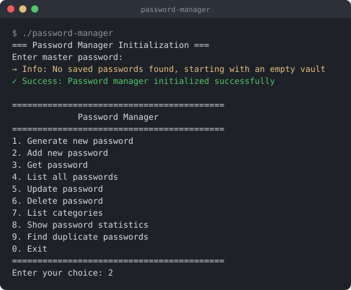
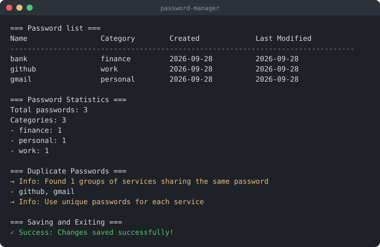

# Password Manager


[](LICENSE)

Консольный менеджер паролей на Go. Хранит пароли в локальном файле, зашифрованном AES-256-GCM, и управляется через текстовое меню в терминале.



## Возможности

| # | Пункт меню | Что делает |
|---|------------|------------|
| 1 | Generate new password | Генерирует случайный пароль заданной длины (от 8 символов) из заглавных и строчных букв, цифр и спецсимволов. Используется криптографический генератор `crypto/rand` |
| 2 | Add new password | Сохраняет пароль для сервиса с категорией. Если оставить пароль пустым, сгенерирует его автоматически |
| 3 | Get password | Показывает пароль и даты создания и изменения для выбранного сервиса |
| 4 | List all passwords | Таблица всех записей, отсортированных по имени. Сами пароли в таблице не показываются |
| 5 | Update password | Меняет пароль. Новый пароль должен содержать не меньше 8 символов, заглавную и строчную букву, цифру и спецсимвол |
| 6 | Delete password | Удаляет запись после подтверждения `y/n` |
| 7 | List categories | Список уникальных категорий без учёта регистра |
| 8 | Show password statistics | Количество паролей всего и по категориям, даты самого нового и самого старого |
| 9 | Find duplicate passwords | Находит сервисы с одинаковым паролем. Сами пароли при этом не выводятся |
| 0 | Exit | Шифрует и сохраняет все данные в файл, затем завершает работу |

Также:

- мастер-пароль вводится скрыто: символы не отображаются в терминале;
- при первом запуске создаётся пустое хранилище, при следующих данные загружаются из файла;
- если мастер-пароль неверный, программа сообщает об ошибке расшифровки и завершается, **не перезаписывая** файл;
- сообщения выделяются цветом: успех — зелёным, ошибки — красным, подсказки — жёлтым.

## Демонстрация



## Требования

- **Go 1.26** или новее (для сборки из исходников);
- **macOS или Linux**. В Windows нужен терминал с поддержкой ANSI-цветов, например Windows Terminal;
- **интерактивный терминал**: мастер-пароль читается через `golang.org/x/term`, поэтому передать ввод через конвейер (`echo ... | ./password-manager`) не получится;
- `make` — необязательно, все команды можно выполнить напрямую через `go`.

## Установка

1. Клонируйте репозиторий:

   ```bash
   git clone https://github.com/egorka-hub/password-manager.git
   cd password-manager
   ```

2. Соберите бинарник. Зависимости скачаются автоматически:

   ```bash
   make build
   # или без make:
   go build -o password-manager .
   ```

3. Запустите:

   ```bash
   ./password-manager
   ```

При первом запуске придумайте мастер-пароль длиной не меньше 8 символов. Запомните его: без него данные расшифровать нельзя, восстановить пароль невозможно.

## Примеры использования

### Команды Makefile

```bash
make            # то же, что make build
make run        # запустить без сборки бинарника (go run .)
make check      # проверить форматирование, запустить go vet и собрать
make fmt        # отформатировать код
make tidy       # привести в порядок go.mod и go.sum
make clean      # удалить бинарник
make help       # список всех команд
```

### Первый запуск

```text
$ ./password-manager
=== Password Manager Initialization ===
Enter master password:
→ Info: No saved passwords found, starting with an empty vault
✓ Success: Password manager initialized successfully
Press Enter to continue...
```

### Добавление пароля с автогенерацией

Если на запрос пароля просто нажать Enter, пароль будет сгенерирован:

```text
Enter your choice: 2
=== Add New Password ===
Enter service name: bank
Enter password (or press Enter to generate):
→ Info: Generated password: SFU+PtZy*0vveBFC
Enter category: finance
✓ Success: Password saved successfully
```

### Поиск пароля

```text
Enter your choice: 3
=== Search Password ===
Enter service name: github
=== Password Details ===
Service: github
Category: work
Password: Sh4red#Pass
Created: 2026-09-28 22:19:39
Last Modified: 2026-09-28 22:19:39
```

### Удаление с подтверждением

```text
Enter your choice: 6
=== Delete Password ===
Enter service name: gmail
Delete gmail? (y/n): y
✓ Success: Password deleted successfully!
```

### Неверный мастер-пароль

```text
$ ./password-manager
=== Password Manager Initialization ===
Enter master password:
✗ Error: Error loading data: decrypt: cipher: message authentication failed
```

Файл с данными при этом не изменяется.

## Как хранятся данные

Пароли сохраняются в файл `passwords.dat` в текущей папке. При выходе программа:

1. сериализует все записи в JSON;
2. шифрует их AES-256 в режиме GCM, который одновременно проверяет целостность данных;
3. записывает в файл случайный nonce (12 байт), а за ним шифротекст.

Каждое сохранение использует новый nonce, поэтому одинаковые данные дают разный шифротекст. Файл `*.dat` добавлен в `.gitignore` и не попадает в репозиторий.

> **Ограничение.** Ключ шифрования сейчас получается напрямую из байтов мастер-пароля (дополняется нулями до 32 байт), без функции растяжения ключа и соли. Поэтому пароль длиннее 32 символов обрезается, а перебор слабого мастер-пароля по украденному файлу обходится дёшево. Проект учебный. Для реальных паролей используйте проверенные менеджеры. Исправление запланировано, см. «Планы по развитию».

## Структура проекта

```text
password-manager/
├── main.go          # весь код приложения
├── go.mod           # модуль и зависимости
├── go.sum           # контрольные суммы зависимостей
├── Makefile         # сборка, запуск и проверки
├── .gitignore       # бинарники, файлы IDE, хранилище *.dat
├── LICENSE          # лицензия MIT
├── README.md
└── docs/            # скриншоты для README
```

Код в `main.go` разделён на слои:

| Слой | Что входит |
|------|------------|
| Модель | `Password`, `PasswordManager`, ошибки `ErrNotInitialized`, `ErrPasswordExists`, `ErrPasswordNotFound`, `ErrWeakPassword` |
| Бизнес-логика | Методы `PasswordManager`: `SavePassword`, `GetPassword`, `UpdatePassword`, `DeletePassword`, `GeneratePassword`, `CheckPasswordStrength`, `ListCategories`, `GetPasswordStats`, `FindDuplicatePasswords` |
| Хранение | `SaveToFile` и `LoadFromFile`: шифрование AES-256-GCM и работа с файлом |
| Консольный интерфейс | `ShowMainMenu`, `PrintPasswordList`, `ShowPasswordDetails`, `ReadUserInput`, цветные сообщения `showSuccess` / `showError` / `showInfo` |
| Обработчики меню | `HandlePasswordGeneration`, `HandlePasswordAdd`, `HandlePasswordSearch`, `HandlePasswordList`, `HandlePasswordUpdate`, `HandlePasswordDelete`, `HandleCategoryList`, `HandlePasswordStats`, `HandleDuplicatePasswords`, `HandleExitAndSave` |
| Точка входа | `main`: инициализация, загрузка хранилища, главный цикл меню |

Единственная внешняя зависимость — `golang.org/x/term` для скрытого ввода пароля.

## Планы по развитию

- [ ] Получать ключ из мастер-пароля через Argon2id со случайной солью, хранящейся в файле
- [ ] Смена мастер-пароля с перешифровкой хранилища
- [ ] Проверка надёжности пароля не только при обновлении, но и при добавлении
- [ ] Атомарное сохранение: запись во временный файл и переименование, чтобы сбой не повредил хранилище
- [ ] Путь к файлу хранилища через флаг командной строки или переменную окружения
- [ ] Поиск по категории в меню (метод `GetPasswordsByCategory` уже есть)
- [ ] Копирование пароля в буфер обмена с автоочисткой вместо вывода на экран
- [ ] Разделение на пакеты (`internal/vault`, `internal/ui`) и юнит-тесты
- [ ] CI в GitHub Actions: `gofmt`, `go vet`, тесты и сборка

## Лицензия

Проект распространяется под лицензией MIT. Подробности в файле [LICENSE](LICENSE).
